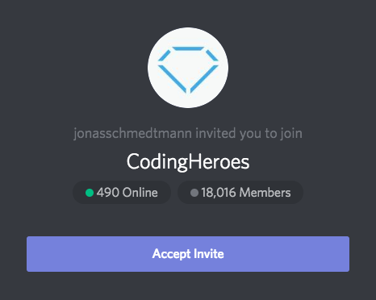

# Advanced CSS and SASS

by [@codebreakerjulia](https://www.instagram.com/codebreakerjulia/)

## insert image for course here

## Session 1

*🗓 S, Nov 17, 2018*  
*📠Haddon Township Library*  
*🕠2:50pm-?*  
*✍️Commits: ?*  

Course Material and FAQ for my Advanced CSS Course [Link](https://github.com/jonasschmedtmann/advanced-css-course) 
Instructor's Resource Page [Link](http://codingheroes.io/resources/) 
Jonas' [Codepen](https://codepen.io/jonasschmedtmann/pens/public/) 

Joined the [Discord discussion group](https://discordapp.com/channels/146186188783484928/146192848750903296) for the class. Password for Discord account is in email. Also downloaded and installed the Discord app for Mac.

### Final Version of Course Projects
* [Natours]() - advanced CSS, Sass and responsive design
* [Trillo]() - Flexbox
* [Nexter]() – CSS Grid

